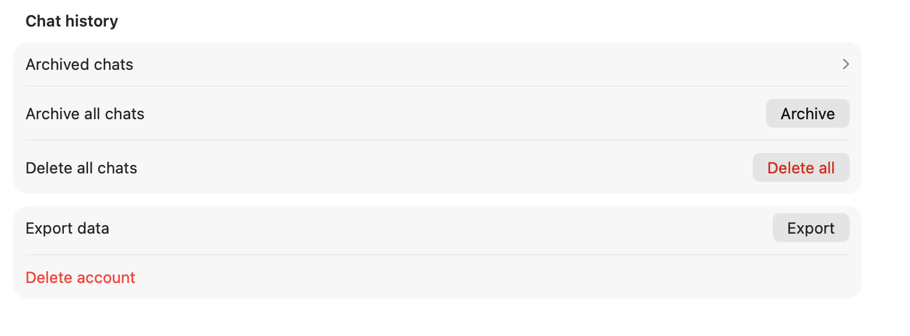

# PTHA — Personal Thought Archive

PTHA is a local-first CLI and MCP server for importing a ChatGPT export into a
private SQLite knowledge archive and searching it from an MCP client.

It is designed for the situation where you export your ChatGPT data, receive a large ZIP file with many JSON files, `.dat` attachments, and loose metadata, and then have no practical way to review, filter, or reuse that material.

PTHA builds a local SQLite database with dense and sparse search indexes, then
serves two read-only MCP tools: `search_archive` and
`construct_archive_context`. The database, model cache, and service socket
remain on the user's machine.



## Why this tool exists

A typical ChatGPT export is useful as a backup, but not very usable as a working archive.

Common problems:

- the export is a large ZIP with many files and little human-readable structure
- project relationships are not directly obvious from the raw payload
- attachments are stored separately and often have confusing names
- common chats and throwaway chats are mixed together with valuable long-form threads
- the data is preserved, but not ready for reuse as a curated knowledge base

This tool solves the practical part of that problem.

It takes the export and produces:

- one Markdown file per chat
- grouping into project-like folders, pinned chats, and common chats
- filtering of likely low-value common chats
- copied attachment files where they can be recovered from the export
- summary and index files for manual review
- a Markdown-first structure that can later be attached to new chats, reused in project contexts, or curated into a separate knowledge archive

## Capabilities

The current tool can:

- read a full ChatGPT export ZIP
- read an extracted export directory
- read a directory containing `conversations-*.json`
- merge multiple `conversations-*.json` files into one logical export bundle
- detect pinned chats
- group project-like chats by `conversation_template_id`
- keep common chats outside project groups
- filter likely low-value common chats into a separate folder
- export every kept chat into Markdown
- include chat metadata and full conversation flow in Markdown
- copy recoverable attachment files into per-group `attachments/` folders
- generate `SUMMARY.md`, `PROPOSED_PROJECT_NAMES.md`, and per-folder `INDEX.md`
- use multithreaded parsing and export for better speed on large bundles
- optionally enable a lightweight NLP naming layer for better project folder names

## Public-repository data policy

This is a public repository. Gold test scenarios, benchmark fixtures, probes,
and evaluation outputs built from a personal export are private local data and
must not be committed here, even when they are useful for reproducible local
checks. Keep them under `benchmarks/gold/` or another ignored local path.

Only synthetic, anonymized examples that contain no personal conversation
content or identifiers may be added to the repository. Before committing a new
benchmark artifact, verify that it meets that rule.

## Installation

### Requirements

- Python `>= 3.13`
- [uv](https://docs.astral.sh/uv/)

### Local development install

```bash
cd /path/to/ptha
uv venv
uv sync
```

### Install optional NLP support

```bash
cd /path/to/ptha
uv sync --extra nlp
```

This installs optional dependencies used only when the NLP mode is explicitly enabled in config.

### PTHA runtime dependencies

On Apple Silicon, PTHA uses MLX with the pinned FP16 BGE-M3 artifact for local
dense and sparse retrieval. PyTorch and SentenceTransformers are not required
for the normal PTHA import, service, or MCP path.

Future extension: Sentence Transformers also supports multimodal models. A later knowledge-base phase can add image or visual attachment indexing for screenshots, diagrams, and rendered pages while preserving `attachment_id`, page, slide, and source-file traceability. This is intentionally outside the text-first MVP and should not be mixed into the current text vector policy without an explicit scoring contract.

### Install as a tool from a local checkout

```bash
uv tool install /path/to/ptha
```

Reinstall after local changes:

```bash
uv tool install --reinstall /path/to/ptha
```

### Install as a tool directly from GitHub

```bash
uv tool install git+https://github.com/anfedoro/ptha
```

Reinstall from GitHub:

```bash
uv tool install --reinstall git+https://github.com/anfedoro/ptha
```

## PTHA local archive and MCP quick start

PTHA imports a ChatGPT export into a local SQLite archive, runs retrieval in a
local background service, and exposes two read-only MCP tools:
`search_archive` and `construct_archive_context`.

```bash
ptha init
time ptha import /path/to/chatgpt-export.zip
ptha service start
ptha mcp config --absolute
```

The MCP client starts `ptha mcp serve`; it requires the retrieval service to be
running first. Large personal archives typically need roughly 20–50 minutes
after the model is cached; import uses phase-labelled progress bars while it
builds search chunks and writes dense+sparse indexes. See
[PTHA first run](docs/first-run.md) for the complete copy-paste path, custom
database placement, CLI validation, LM Studio setup, service shutdown, and
common errors.

## Legacy Markdown distillation implementation

The repository retains the original Markdown-distillation implementation as an
internal library while PTHA is the supported installed tool. It is not exposed
as a second console command in the PTHA wheel.

## Legacy developer reference

### Run with the default config in the current directory

```bash
uv run python -m gpt_export_distillation.cli
```

### Run against an explicit ZIP export

```bash
uv run python -m gpt_export_distillation.cli --input /path/to/chatgpt-export.zip
```

### Run against an extracted export directory

```bash
uv run python -m gpt_export_distillation.cli --input /path/to/export-directory
```

### Write output into a chosen destination

```bash
uv run python -m gpt_export_distillation.cli \
  --input /path/to/chatgpt-export.zip \
  --output-dir /path/to/output-folder
```

### Use a custom config file

```bash
uv run python -m gpt_export_distillation.cli \
  --config /path/to/custom-config.toml \
  --input /path/to/chatgpt-export.zip
```

## Knowledge Base CLI

The experimental knowledge-base layer works on the Markdown archive produced by this tool. It stores all state in one local SQLite file and keeps source references back to project folders, Markdown files, conversations, messages, and attachments.

For the detailed database-build and retrieval call flows, see [Knowledge Base Workflow Architecture](docs/kb-workflow-architecture.md).

Build a query-ready DB in one command:

```bash
uv run kb-index import \
  --input /path/to/distilled-export \
  --db chat_memory.db \
  --dense-device mps \
  --sparse-device mps \
  --dense-torch-dtype float16 \
  --sparse-torch-dtype float16 \
  --sparse-top-k 128
```

This runs chat ingestion, attachment ingestion, embeddings, deterministic semantic nodes, and scoped semantic edges. It prints one JSON report with per-stage stats plus final table counts.
Long-running import and embedding commands show progress on stderr by default; pass `--quiet` to keep only the final JSON on stdout.
The default sparse model is `opensearch-project/opensearch-neural-sparse-encoding-multilingual-v1`, and embedding runs default to separate dense and sparse passes to avoid the memory and throughput issues observed when both transformer models run interleaved in one loop.

On Apple Silicon, a useful first speed experiment is torch on MPS with half precision. Start with `--batch-size 16` for the multilingual sparse model and raise it only after memory is stable:

```bash
uv run kb-index import \
  --input /path/to/distilled-export \
  --db chat_memory.db \
  --dense-device mps \
  --sparse-device mps \
  --dense-torch-dtype float16 \
  --sparse-torch-dtype float16 \
  --batch-size 16 \
  --memory-report-every 50
```

For long one-shot runs, `torch.compile` can be tested as an additional opt-in. It may spend extra time on warm-up and is not guaranteed to help every model/backend:

```bash
uv run kb-index import \
  --input /path/to/distilled-export \
  --db chat_memory.db \
  --dense-device mps \
  --sparse-device mps \
  --dense-torch-dtype float16 \
  --sparse-torch-dtype float16 \
  --dense-torch-compile \
  --sparse-torch-compile \
  --batch-size 16
```

If the sparse model is slower or unstable on MPS/float16, test the dense and sparse paths explicitly:

```bash
uv run kb-index embed \
  --db chat_memory.db \
  --dense-provider sentence-transformers \
  --sparse-provider none \
  --dense-device mps \
  --dense-torch-dtype float16 \
  --force

uv run kb-index embed \
  --db chat_memory.db \
  --dense-provider none \
  --sparse-provider sentence-transformers \
  --sparse-model opensearch-project/opensearch-neural-sparse-encoding-multilingual-v1 \
  --sparse-device mps \
  --sparse-torch-dtype float16 \
  --batch-size 16 \
  --memory-report-every 50 \
  --force
```

The same CLI exposes `--dense-backend` and `--sparse-backend` with `torch`, `onnx`, or `openvino` for later backend experiments.

The lower-level commands are useful for debugging or partial rebuilds:

```bash
uv run kb-index ingest-chats \
  --input /path/to/distilled-export \
  --db chat_memory.db

uv run kb-index ingest-attachments \
  --input /path/to/distilled-export \
  --db chat_memory.db

uv run kb-index embed \
  --db chat_memory.db \
  --sparse-top-k 128

uv run kb-index build-nodes \
  --db chat_memory.db \
  --mode deterministic

uv run kb-index build-edges \
  --db chat_memory.db \
  --scope project \
  --top-k 10 \
  --max-group-size 1000
```

`build-edges` always creates cheap `temporal_neighbor` edges, but it only builds similarity edges for blocks that already have dense vectors or sparse terms. Large groups above `--max-group-size` skip pairwise similarity to avoid accidental full project-level NxN work.

By default, files under `Common/potential_trash` are assigned `interest_tier=low`. Embedding and retrieval skip `low` and `quarantine` content unless explicitly enabled:

```bash
uv run kb-index embed \
  --db chat_memory.db \
  --no-skip-low-interest-content

uv run kb-index import \
  --input /path/to/distilled-export \
  --db chat_memory.db \
  --no-skip-low-interest-content

uv run kb-search context \
  "query text" \
  --db chat_memory.db \
  --include-low-interest
```

Manual retrieval:

```bash
uv run kb-search query \
  "memory routing" \
  --db chat_memory.db \
  --limit 10

uv run kb-search context \
  "memory routing" \
  --db chat_memory.db \
  --budget-tokens 4000
```

`kb-search context` is the preferred interface. It returns a traceable context pack assembled from direct block hits, semantic node expansion, graph neighbor expansion, deduplication, and token-budget selection.

## MCP Server

The local MCP server exposes the knowledge base as a narrow stdio JSON-RPC tool surface. It is designed as an augmentation backend, not a database browser.

Run it locally:

```bash
uv run kb-mcp \
  --db /absolute/path/to/chat_memory.db
```

The public MCP tool set is intentionally minimal:

- `build_context_pack`

Tool input:

```json
{
  "query": "memory routing",
  "token_budget": 4000,
  "project_filter": null,
  "include_low_interest": false,
  "direct_limit": 10,
  "node_limit": 5,
  "node_member_limit": 5,
  "neighbor_limit": 5
}
```

Tool output includes:

- `context_text`: compact augmentation text ready to pass to an LLM
- `selected_blocks`: structured selected memory blocks
- `source_references`: source path, conversation/message/block references
- `source_trace`: retrieval path such as direct block, semantic node member, or graph neighbor
- `scores`: score and reason per selected block

Indexing and writes stay in `kb-index`; the MCP server opens the DB read-only and only serves retrieval context.

## What happens during processing

When the tool runs, it performs these steps:

1. It finds an input source.
2. It loads all `conversations-*.json` files from that source.
3. It loads optional metadata files such as:
   - `conversation_asset_file_names.json`
   - `library_files.json`
   - `shared_conversations.json`
   - `export_manifest.json`
4. It flattens each conversation into an ordered stream of messages.
5. It computes per-chat metrics such as:
   - total messages
   - assistant messages
   - user messages
   - character count
   - estimated code block count
   - URL count
6. It classifies chats into:
   - project-like groups
   - pinned chats
   - common chats
7. It applies the low-value chat filter to common chats only, unless configured otherwise.
8. It generates one Markdown file per chat.
9. It copies recoverable attachments into nearby `attachments/` folders.
10. It writes summary files and folder indexes.
11. It proposes human-readable project folder suffixes when possible.

## Output structure

A typical output structure looks like this:

```text
output/
  SUMMARY.md
  PROPOSED_PROJECT_NAMES.md
  ATTACHMENTS.md
  FILES.md
  Common/
    useful/
      INDEX.md
      some_chat.md
      attachments/
    potential_trash/
      INDEX.md
      old_short_chat.md
      attachments/
  Pinned/
    INDEX.md
    pinned_chat.md
    attachments/
  Projects/
    Project_01 - Example Name/
      INDEX.md
      chat_one.md
      chat_two.md
      attachments/
    Project_02/
      INDEX.md
      ...
```

### Main output files

- `SUMMARY.md`
  - export-level summary
  - total conversation counts
  - useful vs potential trash counts
  - group counts
- `PROPOSED_PROJECT_NAMES.md`
  - suggested folder names for project-like groups
  - confidence labels when naming is enabled
- `ATTACHMENTS.md`
  - attachment filename mapping summary from the export
- `FILES.md`
  - file/library metadata summary from the export

### Chat Markdown format

Each chat Markdown file contains:

- chat title
- stable chat id if available
- `conversation_template_id`
- source label
- create/update timestamps in UTC
- message counters
- the full ordered message flow
- message ids and message timestamps

This is intentionally simple and portable. The result is easy to search with local tools and easy to reuse later.

## Configuration reference

Default config file: [`gpt_export_distillation.toml`](./gpt_export_distillation.toml)

Example:

```toml
[input]
search_dir = "."
conversations_glob = "conversations-*.json"
include_zip = true
zip_glob = "*.zip"

[filters]
old_days = 60
max_assistant_messages_for_old_common = 9
apply_only_to_non_project_non_pinned = true

[grouping]
project_prefix = "Project"
projects_folder_name = "Projects"
common_folder_name = "Common"
useful_folder_name = "useful"
potential_trash_folder_name = "potential_trash"
pinned_folder_name = "Pinned"
keep_pinned_separately = true

[grouping.project_name_overrides]
"g-p-example-template-id" = "BGP LM"

[output]
root_folder_name = "md_export"
output_dir = ""
include_files_summary = true
include_attachments_summary = true

[performance]
workers = 8

[nlp]
enabled = true
naming_mode = "nlp"
max_phrase_words = 3
min_repeated_titles = 2
fill_all_project_names = true
```

### `[input]`

- `search_dir`
  - base directory used when no explicit `--input` is passed
- `conversations_glob`
  - glob for locating `conversations-*.json`
- `include_zip`
  - whether ZIP files should also be discovered automatically
- `zip_glob`
  - glob for ZIP discovery

### `[filters]`

- `old_days`
  - number of days after which a chat is considered old for filtering purposes
- `max_assistant_messages_for_old_common`
  - maximum assistant message count allowed before an old common chat is treated as useful
- `apply_only_to_non_project_non_pinned`
  - if `true`, the filter only affects common chats and never project or pinned chats

### `[grouping]`

- `project_prefix`
  - base prefix for generated project groups, for example `Project`
- `projects_folder_name`
  - top-level folder name for project-like chats
- `common_folder_name`
  - top-level folder name for non-project, non-pinned chats
- `useful_folder_name`
  - subfolder for kept common chats
- `potential_trash_folder_name`
  - subfolder for filtered low-value common chats
- `pinned_folder_name`
  - top-level folder name for pinned chats
- `keep_pinned_separately`
  - if `true`, pinned chats are always exported into a dedicated pinned folder
- `project_name_overrides`
  - manual mapping from `conversation_template_id` to a chosen project name

### `[output]`

- `root_folder_name`
  - default output folder name when `--output-dir` is not provided
- `output_dir`
  - optional fixed output directory from config
- `include_files_summary`
  - write `FILES.md`
- `include_attachments_summary`
  - write `ATTACHMENTS.md`

### `[performance]`

- `workers`
  - number of worker threads for parsing and export
  - `0` means automatic selection

### `[nlp]`

- `enabled`
  - enables optional NLP support
  - when `false`, NLP code is not initialized
- `naming_mode`
  - naming strategy
  - supported values currently include:
    - `basic`
    - `auto`
    - `nlp`
- `max_phrase_words`
  - maximum n-gram size used while proposing project names
- `min_repeated_titles`
  - minimum repetition threshold for stronger project-name suggestions
- `fill_all_project_names`
  - if `true`, every project group receives a proposed suffix even when confidence is low

## Project naming behavior

Project names are inferred from content because current export bundles do not reliably include human-readable ChatGPT project names as structured metadata.

This means the tool works with what is actually present in the export:

- `conversation_template_id` for stable grouping
- chat titles for heuristic naming
- optional NLP normalization for better token handling
- optional manual overrides when you already know the true name

### Confidence levels

When the tool writes `PROPOSED_PROJECT_NAMES.md`, suggested names may be marked with:

- `high`
  - repeated multi-word phrase found across titles
- `medium`
  - repeated informative token signal, but weaker than a repeated phrase
- `low`
  - forced fallback because `fill_all_project_names = true`
- `none`
  - no name proposed

## Optional NLP mode

The tool remains fully usable without NLP dependencies.

To install optional NLP support:

```bash
uv sync --extra nlp
```

To enable it:

```toml
[nlp]
enabled = true
naming_mode = "nlp"
fill_all_project_names = true
```

Current NLP support is intentionally lightweight. It improves token normalization and naming heuristics, but it does not reconstruct missing project metadata from the export.

## Notes and limitations

- ChatGPT export bundles preserve the data, but not every UI concept is exported in a clean structured form.
- Human-readable project names may be missing even when projects clearly exist in the ChatGPT UI.
- Naming is heuristic unless you provide `project_name_overrides`.
- Attachment recovery depends on what the export actually contains.
- This tool is designed to create a practical working archive, not to perfectly reproduce the original ChatGPT interface.

## Typical workflow

A practical workflow looks like this:

1. Export your ChatGPT data.
2. Run the legacy developer command on the ZIP file, or use the supported PTHA import path above.
3. Review `SUMMARY.md` and `PROPOSED_PROJECT_NAMES.md`.
4. Inspect `Common/potential_trash/` for chats that can likely be discarded.
5. Keep useful project and pinned chat Markdown files.
6. Reuse selected Markdown files later in new chats, project uploads, or local search/indexing workflows.

## Export format notes

See [`docs/export-format-spec.md`](./docs/export-format-spec.md) for the locally inferred schema and the export format notes collected during development.
