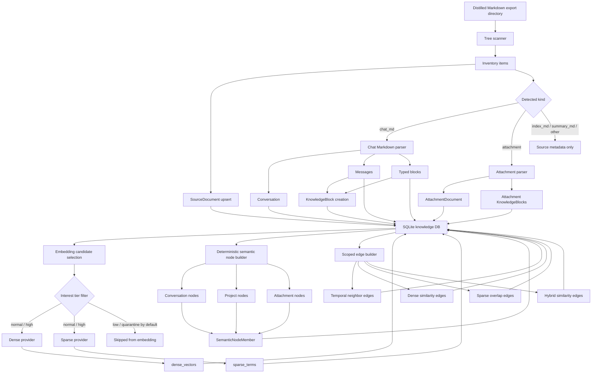
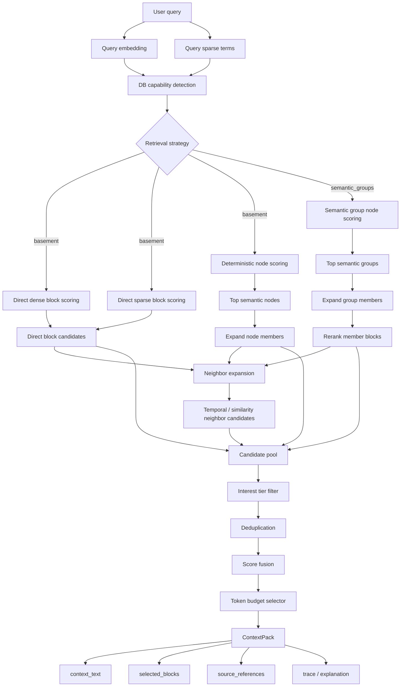
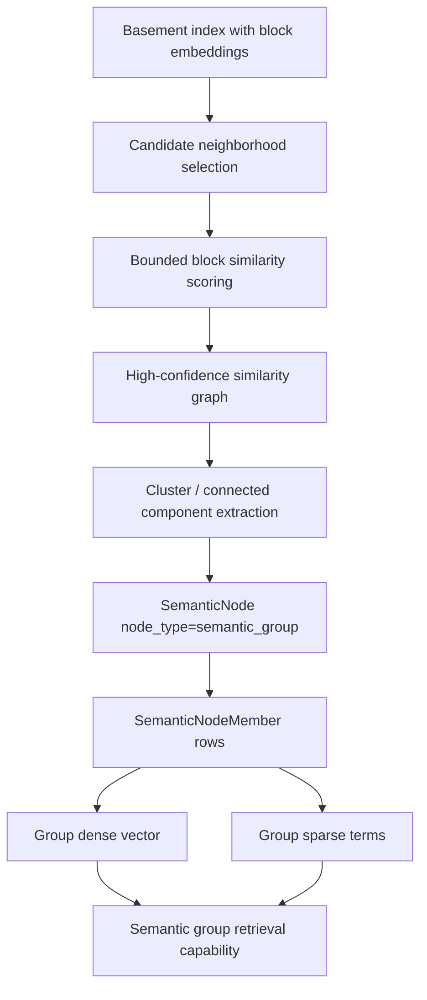
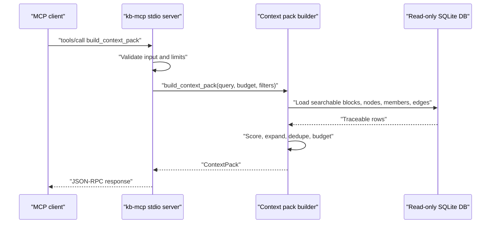

# Knowledge Base Architecture Workflows

This note captures the working mental model for the local knowledge-base layer. It is intentionally separate from the committed README so it can evolve while the implementation is still changing.

## Database Build Workflow



The build path is structure-first. Markdown files are not treated as flat text: the scanner preserves folder/project/attachment origin, the chat parser preserves conversation and message order, and `KnowledgeBlock` rows keep traceable links back to source document, conversation, message, block, and attachment identifiers.

The one-shot CLI command maps to this workflow:

```bash
kb-index import \
  --input /path/to/distilled-export \
  --db chat_memory.db
```

Lower-level commands remain available for diagnosis: `ingest-chats`, `ingest-attachments`, `embed`, `build-nodes`, and `build-edges`.

## Retrieval / Context Pack Workflow



This is not intended to be a plain vector-only RAG path. Direct block hits remain first-class, but node expansion and graph neighbor expansion add structured candidates that may not be top direct vector hits. The final context pack keeps the route for each selected item, such as `query -> block direct`, `query -> node -> member block`, or `query -> block -> neighbor`.

The retrieval strategy is capability-driven:

- `auto`: use `semantic_groups` only when semantic group nodes and group-level vectors or sparse terms exist.
- `basement`: use direct block search, deterministic conversation/project/attachment node expansion, and neighbor expansion.
- `semantic_groups`: use semantic group node search and group member expansion, while retaining direct block fallback.

The MCP server defaults to `auto`, so a DB without the optional semantic group layer continues to use basement retrieval.

## Optional Semantic Group Index Workflow



This layer should be built after basement indexing. It must avoid global NxN scoring; candidate neighborhoods should be scoped by project, conversation windows, attachments, existing edges, or sparse-term overlap.

## MCP Runtime Workflow



The MCP layer is intentionally narrow. It does not expose the database as a browser; it exposes an augmentation operation that returns compact context and source references for an LLM client.

## Traceability Contract

Every selected memory item should be traceable to at least:

- source tree area: `Common/useful`, `Common/potential_trash`, `Pinned`, or `Projects/*`
- `source_documents.relative_path`
- `conversation_id`, when available
- `message_id`, when available
- `block_id`, when selected from chat content
- `attachment_id` and attachment path, when selected from extracted attachment content

## Operational Notes

- `Common/potential_trash` maps to `interest_tier=low`.
- Retrieval excludes `low` and `quarantine` by default.
- Embedding skips low-interest content by default.
- Edge building avoids full project-level NxN similarity work by limiting pairwise scoring to groups under `--max-group-size`.
- Progress output goes to stderr; final CLI reports remain JSON on stdout.
