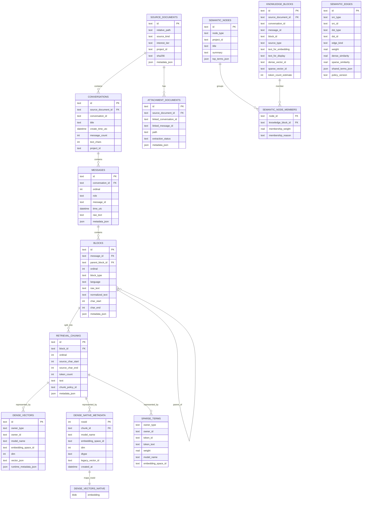

# SQLite Database Schema

This document describes the current SQLite knowledge-base schema used by
`kb-index`, `kb-search`, the context builder, and the semantic graph builders.
It describes the database as it exists today, including the transitional
`knowledge_blocks` layer.

## 1. Logical Tree

```text
SQLite database
├── Source catalog
│   ├── source_documents
│   ├── conversations
│   ├── messages
│   ├── blocks
│   └── retrieval_chunks
├── Attachment catalog
│   └── attachment_documents
├── Legacy / compatibility retrieval layer
│   └── knowledge_blocks
├── Chunk-level embedding storage
│   ├── dense_vectors                    legacy JSON representation
│   ├── dense_native_metadata            sqlite-vec row mapping
│   ├── dense_vectors_native             sqlite-vec virtual table
│   └── sparse_terms
├── Semantic graph layer
│   ├── semantic_nodes
│   ├── semantic_node_members
│   └── semantic_edges
├── Operational metadata
│   ├── schema_migrations
│   ├── ingestion_runs
│   └── retrieval_traces
└── SQLite-managed indexes
    ├── PRIMARY KEY / UNIQUE autoindexes
    └── explicit idx_* indexes
```

The canonical retrieval path is:

```text
source document
  -> conversation
    -> message.raw_text
      -> structural block
        -> retrieval chunk
          -> dense vector and sparse terms
```

`messages.raw_text` is the canonical complete message text. A structural block
stores its type and source coordinates. A retrieval chunk is the searchable
fragment. Dense and sparse representations are owned by the chunk through
`owner_type = 'retrieval_chunk'` and `owner_id = retrieval_chunks.id`.

## 2. Entity-Relationship Diagram



The diagram shows the declared foreign-key relationships. The embedding tables
use a polymorphic `owner_type`/`owner_id` contract, so their relationship to a
retrieval chunk is enforced by application logic and compatibility checks rather
than by a SQLite foreign key.

For DENSE_VECTORS_NATIVE, embedding is the only application-visible vector
column. float[1024] and distance_metric=cosine are parameters of the sqlite-vec
virtual-table declaration, not separate SQLite columns.

There are deliberately two dense representations in the current transition:

    legacy dense_vectors.vector_json
        TEXT containing JSON numbers

    native dense_vectors_native.embedding
        BLOB containing little-endian float32[1024]

The legacy table was not altered in place. The native BLOB table exists only on
the migration copy and is the candidate replacement after complete parity and
data-quality checks. The JSON labels elsewhere in this document refer to
actual JSON text columns such as metadata_json and the legacy vector_json; they
do not describe the native vector payload.

## 3. Source Catalog

### `source_documents`

One row per imported source file or logical source document.

```text
source_documents
├── id                       stable source-document identifier
├── path                     absolute or original source path
├── relative_path            path relative to the imported export
├── source_kind              source category, for example chat or markdown
├── folder_kind              export folder classification
├── interest_tier            normal / low / quarantine-style filtering tier
├── project_id               normalized project identifier
├── project_name             project display name
├── file_name, extension     source file identity
├── sha256                   content identity for incremental ingestion
├── created_at, updated_at   source timestamps when available
└── metadata_json            extensible source metadata object
```

`UNIQUE(relative_path, sha256)` prevents the same source revision from being
ingested repeatedly.

### `conversations`

Conversation-level metadata linked to its source document.

```text
conversations
├── id                       internal conversation row ID
├── source_document_id       parent source document
├── conversation_id          export-provided conversation ID
├── conversation_template_id export template ID
├── title                    conversation title
├── create_time_utc
├── update_time_utc
├── message_count
├── assistant_messages
├── user_messages
├── text_chars
├── estimated_code_blocks
├── project_id
├── folder_kind
└── metadata_json
```

### `messages`

The message table contains the canonical original message content.

```text
messages
├── id                       internal message row ID
├── conversation_id          parent conversation
├── ordinal                  message order within conversation
├── role                     user / assistant / system, etc.
├── message_id               export-provided message ID
├── time_utc                 message timestamp
├── raw_text                 complete original message text
└── metadata_json            additional parsed message metadata
```

Constraint: `UNIQUE(conversation_id, ordinal)`.

## 4. Structural Blocks and Retrieval Chunks

### `blocks`

A block is a structural region of a message, not necessarily an embedding unit.
Examples of `block_type` are `prose`, `code`, `list`, and `table`.

```text
blocks
├── id                       structural block ID
├── message_id               owning message
├── conversation_id          denormalized traversal key
├── parent_block_id          nullable self-reference for future nesting
├── ordinal                  block order within message
├── block_type               structural type
├── language                 detected language, nullable
├── raw_text                 block source text
├── normalized_text          parser-normalized block text
├── char_start               start offset in messages.raw_text
├── char_end                 exclusive end offset
└── metadata_json             parser-specific metadata
```

The source range is `[char_start, char_end)`. `parent_block_id` allows nested
structure without introducing a separate hard-coded subblock table.

### `retrieval_chunks`

A chunk is the canonical searchable fragment for the current chunk-based index.

```text
retrieval_chunks
├── id                       chunk ID
├── block_id                 parent structural block
├── ordinal                  chunk order inside block/policy
├── source_char_start        source start offset
├── source_char_end          exclusive source end offset
├── token_count              tokenizer-aware content length
├── text                     chunk-local searchable text
├── chunk_policy_id          e.g. canonical_token_chunks:v2
└── metadata_json            chunk audit and policy metadata
```

The uniqueness constraint is `UNIQUE(block_id, chunk_policy_id, ordinal)`. Chunk
ranges may overlap under token-window fallback, but coverage must not contain
gaps. Conversation, message role, project, and block metadata are inherited by
joining `retrieval_chunks -> blocks -> messages -> conversations`.

## 5. Attachment and Compatibility Layer

### `attachment_documents`

Catalog of attachment files discovered during ingestion and their extraction
status. `linked_conversation_id` and `linked_message_id` connect an attachment
to its conversational context when that relationship is available.

### `knowledge_blocks`

This is a compatibility and semantic-graph layer retained from the earlier
block-oriented model. Its text fields and vector ID fields are not the canonical
source for the current chunk-level embedding pipeline.

```text
knowledge_blocks
├── id
├── source_type
├── source_document_id
├── conversation_id / message_id / block_id
├── attachment_id
├── project_id / folder_kind
├── interest_tier / role / block_type
├── text_for_embedding       legacy embedding text
├── text_for_display         legacy display text
├── dense_vector_id
├── sparse_vector_id
├── token_count_estimate
└── metadata_json
```

New chunk-level vectors use `retrieval_chunks.id`. Existing vectors with
`owner_type = 'knowledge_block'` are legacy block-level representations and
must not be interpreted as chunk vectors.

## 6. Embedding Storage

### `dense_vectors`

One row per dense representation and embedding space.

```text
dense_vectors
├── id                       representation row ID
├── owner_type               retrieval_chunk or legacy knowledge_block
├── owner_id                 ID in the owner domain
├── model_name               model identity
├── model_version            compatibility version
├── embedding_space_id       model/pooling/normalization/limit identity
├── runtime_metadata_json    device, dtype, backend, compile settings
├── dim                      vector dimension
├── vector_json              serialized numeric vector
└── created_at
```

`embedding_space_id` describes semantic compatibility. Runtime settings are
stored separately so compatible vectors can be reused across device and dtype
changes where the embedding space remains the same.

### dense_native_metadata

The mapping table for the sqlite-vec dense backend. It gives the extension's
INTEGER rowid a stable application identity and keeps compatibility metadata
outside the vector payload.

Fields:

    rowid              deterministic INTEGER vector rowid
    chunk_id           retrieval_chunks.id
    model_name         dense model identity
    embedding_space_id embedding-space compatibility identity
    dim                vector dimension, currently 1024
    dtype              currently float32-le
    legacy_vector_id   source dense_vectors.id
    created_at         source/migration timestamp

The rowid is assigned by stable owner_id, legacy_vector_id order during
migration and is not a hash.

### dense_vectors_native

This is a sqlite-vec virtual table:

    CREATE VIRTUAL TABLE dense_vectors_native
    USING vec0(embedding float[1024] distance_metric=cosine);

The vector is stored as a native little-endian float32 blob. The extension
maintains its own shadow tables, currently including:

    dense_vectors_native_chunks
    dense_vectors_native_info
    dense_vectors_native_rowids
    dense_vectors_native_vector_chunks00

These shadow tables are implementation details of sqlite-vec and must not be
queried by application code. The application joins the virtual table to
dense_native_metadata by rowid.

### dense_native_migrations

One-row migration state and audit record:

    schema_version
    source_db_path
    source_dense_count
    migrated_count
    expected_dim
    model_name
    embedding_space_id
    status                   running / completed / failed
    started_at / finished_at
    audit_json               invalid, NaN, orphan, duplicate counters

The current migration copy is intentionally marked failed: the source JSON
index contains eight retrieval-chunk vectors whose 1024 values are all NaN.
Those rows are rejected rather than silently converted to zeros. The original
dense_vectors table remains intact until a complete migration and parity check
succeed.

### `sparse_terms`

Sparse vectors are stored in decomposed inverted-term form: one row per term in
one owner representation.

```text
sparse_terms
├── owner_type               normally retrieval_chunk
├── owner_id                 chunk or legacy owner ID
├── token_id                 sparse vocabulary identifier
├── token_text               decoded term text
├── weight                   sparse term weight
├── model_name
└── embedding_space_id
```

The primary key is `(owner_type, owner_id, token_id, model_name)`. The current
schema stores both `token_id` and `token_text` per term, which is useful for
diagnostics but is also a major storage cost.

## 7. Semantic Graph

### `semantic_nodes`

Deterministic or semantic groups over knowledge blocks. A node stores a title,
summary, project scope, optional vector references, and top terms.

### `semantic_node_members`

Many-to-many membership between a semantic node and a `knowledge_blocks` row.
`membership_weight` and `membership_reason` explain why a block belongs to the
node.

### `semantic_edges`

Directed, typed relationships between graph entities. The edge stores the
combined weight and optional dense similarity, sparse similarity, shared terms,
and policy version used to produce it.

## 8. Operational Tables

### `schema_migrations`

Applied schema versions:

```text
version       integer primary key
applied_at    migration timestamp
```

### `ingestion_runs`

One row per import/build attempt. `stats_json` stores stage counters and the
final status.

### `retrieval_traces`

Optional query trace storage. `query` stores the request text and
`trace_json` stores the retrieval path, diagnostics, scores, and selected
context when tracing is enabled.

## 9. Indexes

Explicit indexes defined by the schema:

```text
idx_source_documents_kind
  source_documents(source_kind, folder_kind, project_id)

idx_source_documents_interest
  source_documents(interest_tier)

idx_messages_conversation
  messages(conversation_id, ordinal)

idx_blocks_conversation
  blocks(conversation_id, ordinal)

idx_retrieval_chunks_block
  retrieval_chunks(block_id, chunk_policy_id, ordinal)

idx_knowledge_blocks_project
  knowledge_blocks(project_id, folder_kind, block_type)

idx_knowledge_blocks_interest
  knowledge_blocks(interest_tier)

idx_dense_native_metadata_space
  dense_native_metadata(model_name, embedding_space_id, chunk_id)
```

SQLite also creates autoindexes for primary keys and unique constraints. The
most important large autoindexes in the current full database are the primary
key/unique indexes for `sparse_terms`, `dense_vectors`, and
`retrieval_chunks`.

## 10. Typical Retrieval Join

The direct chunk-level retrieval result reconstructs inherited provenance with
a join equivalent to:

```sql
SELECT
    rc.id AS chunk_id,
    rc.text AS chunk_text,
    rc.ordinal AS chunk_ordinal,
    rc.source_char_start,
    rc.source_char_end,
    b.id AS block_id,
    b.block_type,
    b.language,
    m.id AS message_id,
    m.message_id AS source_message_id,
    m.role,
    m.ordinal AS message_ordinal,
    c.id AS conversation_id,
    c.conversation_id AS source_conversation_id,
    c.title,
    sd.relative_path AS source_path
FROM retrieval_chunks AS rc
JOIN blocks AS b ON b.id = rc.block_id
JOIN messages AS m ON m.id = b.message_id
JOIN conversations AS c ON c.id = m.conversation_id
JOIN source_documents AS sd ON sd.id = c.source_document_id
WHERE rc.chunk_policy_id = ?;
```

Dense and sparse scores are computed separately and attached to this result;
they are not stored as columns on `retrieval_chunks`.

## 11. Important Storage Semantics

1. `messages.raw_text` is the canonical original message.
2. `blocks` preserve structural type and source offsets.
3. `retrieval_chunks.text` is the searchable chunk representation.
4. `dense_vectors` and `sparse_terms` reference chunks through the polymorphic
   owner contract.
5. `knowledge_blocks` remains for compatibility and semantic graph membership;
   it is not the source of truth for new chunk embeddings.
6. `metadata_json` fields are extensibility points and may contain parser,
   ingestion, audit, or provider-specific JSON objects.
7. `chunk_policy_id` and `embedding_space_id` are part of index compatibility;
   changing them requires a separate representation or rebuild.

## 12. Native Dense Migration Status

The native dense implementation is present in the repository, but the current
real-data migration copy is not production-ready. The source JSON index contains
eight retrieval-chunk vectors with all 1024 values equal to NaN. Migration
rejects them and records status failed; it does not replace them with zero
vectors and does not modify the source database.

The native layer has been validated on the remaining 135184 vectors:

    native representation: float32-le, dimension 1024
    numeric parity sample: 1000 vectors
    max absolute error after cast: 0
    max cosine difference: 2.22e-16
    top-20 ranking parity on a valid query: identical

The legacy dense table must remain until the eight invalid source
representations are explicitly repaired or regenerated and a complete
135192-vector parity audit passes.
