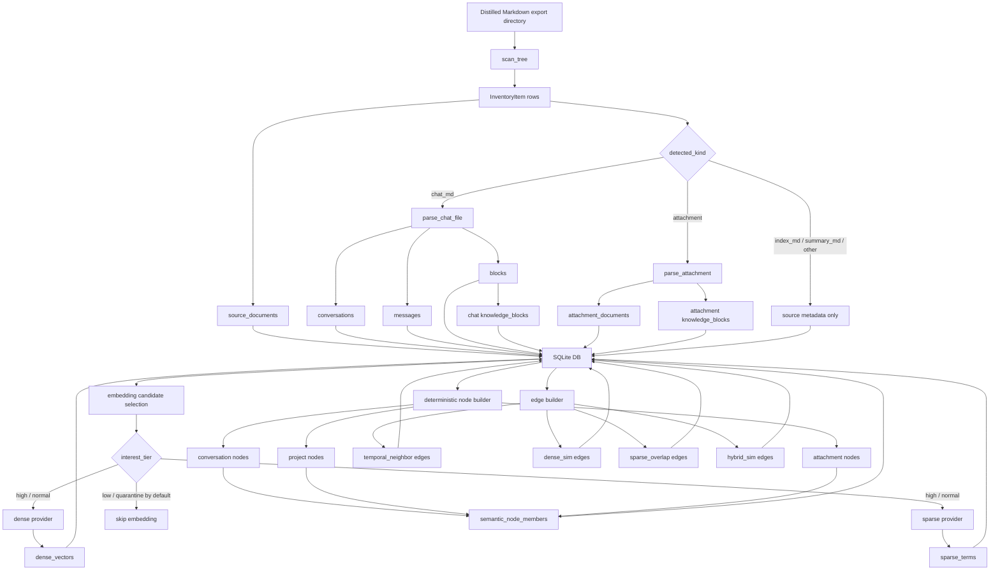
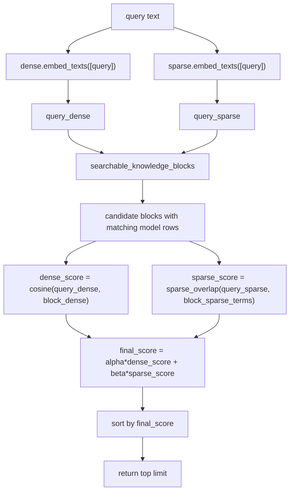
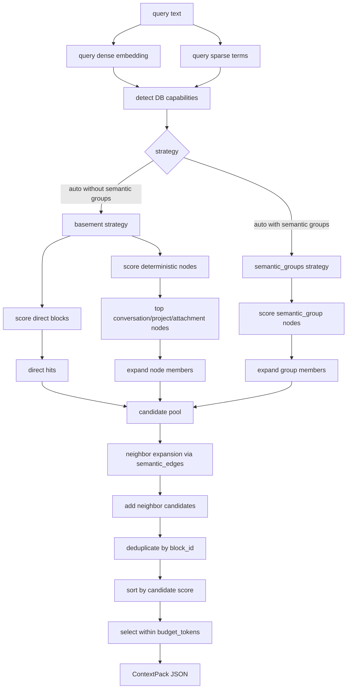

# Knowledge Base Workflow Architecture

This document explains how the local knowledge-base layer builds its SQLite database and how retrieval works through `kb-search query` and `kb-search context`.

The short version:

- `kb-index import` builds a structured database from the distilled Markdown archive.
- `kb-search query` is a diagnostic top-k block search.
- `kb-search context` builds an augmentation payload for an LLM client.
- Dense and sparse signals are both used at query time when both providers are enabled.
- The current context builder is layered, but its score mixing still needs calibration before graph-expanded blocks can be treated as equally ranked with direct hits.

## Database Build Workflow

`kb-index import` is the one-shot command. Internally it runs five stages in order:

1. Ingest chat Markdown files.
2. Ingest supported attachments.
3. Embed `knowledge_blocks`.
4. Build deterministic semantic nodes.
5. Build semantic edges.

The implementation entry point is `kb.cli.import_knowledge_base`.



### Stage 1: Chat Ingestion

The scanner walks the distilled export tree and classifies files by structure:

- `Projects/*`
- `Pinned`
- `Common/useful`
- `Common/potential_trash`
- archive-level files such as `SUMMARY.md`, `INDEX.md`, `ATTACHMENTS.md`, `FILES.md`
- attachment files

Each discovered file is represented as a `SourceDocument`. Files under `Common/potential_trash` are assigned `interest_tier=low`; other content defaults to `normal`.

For chat Markdown files, the parser extracts:

- one `Conversation`
- ordered `Message` rows
- typed `Block` rows
- traceable `KnowledgeBlock` rows for searchable content

The important design point is that the Markdown archive is not ingested as flat text. The database keeps project, folder, conversation, message, block, attachment, and source-path identity.

### Stage 2: Attachment Ingestion

Supported attachments are extracted into `AttachmentDocument` plus attachment-backed `KnowledgeBlock` rows. Unsupported files are still represented as attachment documents with an extraction status, so the source inventory remains complete.

Attachment blocks are searchable only when text extraction succeeds. OCR is not part of the current MVP.

### Stage 3: Embeddings

The embedding stage works over `knowledge_blocks.text_for_embedding`.

Dense embeddings:

- stored in `dense_vectors`
- linked from `knowledge_blocks.dense_vector_id`
- used for cosine similarity at query time

Sparse embeddings:

- stored as token-weight rows in `sparse_terms`
- linked conceptually by `owner_type`, `owner_id`, and `model_name`
- used for sparse overlap scoring at query time

By default, embedding skips `interest_tier IN ('low', 'quarantine')`. Passing `--no-skip-low-interest-content` includes those blocks.

The current default models are:

- dense: `sentence-transformers/all-MiniLM-L6-v2`
- sparse: `opensearch-project/opensearch-neural-sparse-encoding-multilingual-v1`

The model names matter. Retrieval only sees rows indexed with the same model identifiers that the search command asks for. If the sparse model differs, sparse terms will not match the query path.

### Stage 4: Deterministic Semantic Nodes

`build-nodes` creates deterministic `SemanticNode` rows without LLM summarization:

- `conversation` node: blocks from one conversation
- `project` node: blocks from one project
- `attachment` node: blocks from one attachment

Membership is stored in `semantic_node_members`. One block may belong to multiple nodes. Node sparse terms are aggregated from member sparse terms; dense node vectors exist only when the builder has enough linked dense vectors to aggregate.

These nodes are structural grouping aids. They are not yet the later high-level semantic-group layer.

### Stage 5: Semantic Edges

`build-edges` creates computed block-to-block edges under a bounded scope:

- `conversation`
- `project`
- `attachment`

The builder avoids unbounded global NxN work. Large groups above `--max-group-size` skip expensive similarity pair scoring.

Edges may include:

- `temporal_neighbor`
- `dense_sim`
- `sparse_overlap`
- `hybrid_sim`

These edges are later used by `kb-search context` for neighbor expansion.

## `kb-search query`

`kb-search query` is the simpler retrieval path. It is useful for diagnostics and manual inspection.



Current defaults:

- `alpha=0.65`
- `beta=0.35`
- dense provider enabled by default
- sparse provider enabled by default
- low/quarantine content excluded unless `--include-low-interest` is passed

What `candidate_blocks` means:

- It is the count of searchable blocks loaded from SQLite before final top-k truncation.
- A block is searchable when it has at least one matching embedding path requested by the command.
- With both providers enabled, the SQL filter accepts blocks that have either a matching dense vector or matching sparse terms.

What the printed scores mean:

- `dense`: cosine similarity between query dense vector and block dense vector.
- `sparse`: normalized overlap between query sparse token weights and block sparse token weights.
- `score`: weighted sum of dense and sparse.
- `overlap`: the top shared sparse terms by contribution.

If `dense=0.0000` appears in the CLI table, that may be formatting. To know whether dense is truly inactive, use JSON output or add higher-precision diagnostics. A real all-zero dense path would mean dense vectors were missing, dimension-mismatched, or too small after scoring to affect the printed value.

## `kb-search context`

`kb-search context` builds an LLM augmentation payload. It uses direct retrieval plus structural expansion and then selects a token-budgeted set of blocks.



The returned payload contains:

- `selected_blocks`: the blocks selected for augmentation.
- `scores`: compact block id, score, and reason list for selected blocks.
- `source_trace`: all recorded paths that produced candidates.
- `db_capabilities`: which retrieval layers exist in the current database.
- `retrieval_strategy_used`: the actual path used after capability detection.

### Direct Block Path

The direct path uses the same scoring as `kb-search query`:

```text
direct_score = 0.65 * dense_score + 0.35 * sparse_score
```

Those candidates get reason:

```text
query -> block direct
```

### Node Member Path

The node path first scores nodes with the same dense+sparse formula, then expands their members:

```text
member_score = node_score * membership_weight
```

Those candidates get reason similar to:

```text
query -> node:conversation -> member block
query -> node:project -> member block
query -> node:attachment -> member block
```

This is structurally different from direct block retrieval: a member block can enter because its containing conversation/project/attachment node matched the query, even if that exact block was not a top direct hit.

### Neighbor Path

The neighbor path starts from the current candidate pool and follows `semantic_edges`:

```text
neighbor_score = edge_weight * 0.5
```

Those candidates get reason:

```text
query -> block -> neighbor
```

Current limitation: this score does not yet inherit the source block's query relevance. That means neighbor scores are not fully comparable to direct scores. A better formula would be:

```text
neighbor_score = source_block_score * edge_weight * neighbor_decay
```

Until that calibration is implemented, graph-expanded blocks should be interpreted as useful context expansion candidates, not as proof that they are more query-relevant than lower-scored direct hits.

## Query vs Context

| Aspect | `kb-search query` | `kb-search context` |
| --- | --- | --- |
| Primary purpose | Inspect top direct block matches | Build compact LLM augmentation context |
| Uses query dense embedding | Yes, if dense provider enabled | Yes, if dense provider enabled |
| Uses query sparse embedding | Yes, if sparse provider enabled | Yes, if sparse provider enabled |
| Scores direct blocks | Yes | Yes |
| Scores semantic nodes | No | Yes |
| Expands node members | No | Yes |
| Expands graph neighbors | No | Yes |
| Deduplicates multi-path candidates | Not needed | Yes |
| Applies token budget | No | Yes |
| Best for | Debugging retrieval quality | Feeding an MCP/LLM client |

## How Dense and Sparse Signals Affect Results

Dense retrieval helps when the query and block are semantically close but do not share many literal terms.

Sparse retrieval helps when exact or near-exact terminology matters, including project vocabulary, code identifiers, protocol names, and multilingual lexical matches.

The current scoring formula is a direct weighted sum:

```text
final_score = alpha * dense_score + beta * sparse_score
```

This is simple and inspectable, but it assumes dense and sparse scores are reasonably comparable after their own normalization. That assumption should be validated with higher-precision diagnostics on real queries.

## Cold Start and MCP Runtime

Every `kb-search` CLI invocation starts a new Python process and loads the dense and sparse models again. For short queries, model loading can dominate the runtime.

The MCP server should be treated differently:

- start once as a long-lived stdio process;
- load providers once;
- keep the SQLite DB open read-only or open short read-only connections;
- answer many `build_context_pack` requests without reloading models.

This is why CLI latency is not representative of a warm MCP runtime.

## Current Known Retrieval Diagnostics Gaps

The architecture is layered, but the diagnostics are still too coarse for serious tuning:

- CLI text output rounds dense and sparse scores to four decimals.
- `context` output does not expose dense/sparse sub-scores per selected path.
- neighbor scores currently use edge weight rather than inherited query relevance.
- default query quality should be sanity-checked with known project-specific phrases such as `memory routing`.

The next scoring cleanup should add higher-precision debug output and make graph expansion scores inherit the source candidate score.
